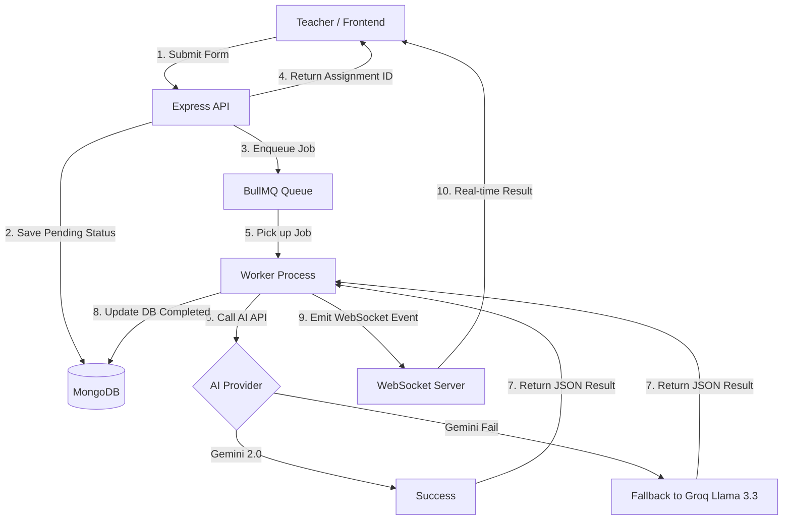

# 💎 VedaAI — AI Assessment Creator

[](https://nextjs.org/)
[](https://nodejs.org/)
[](https://www.typescriptlang.org/)
[](https://www.mongodb.com/)
[](https://redis.io/)
[](https://bullmq.io/)
[](https://ai.google.dev/)
[](https://groq.com/)

**VedaAI** is a full-stack, AI-powered assessment generator designed to help teachers create beautifully structured, high-quality question papers in seconds. By simply specifying a subject, class, and chapter, VedaAI leverages state-of-the-art LLMs (Gemini 2.0 and Groq Llama 3.3) to generate detailed assignments complete with difficulty-tagged questions, comprehensive instructions, and a teacher's answer key.

---

## 📖 Table of Contents
- [✨ Key Features](#-key-features)
- [🛠️ Tech Stack](#️-tech-stack)
- [🏗️ System Architecture](#️-system-architecture)
- [📂 Project Structure](#-project-structure)
- [🚀 Local Setup & Installation](#-local-setup--installation)
- [🔌 API Documentation](#-api-documentation)
- [🤖 AI Inference Strategy](#-ai-inference-strategy)

---

## ✨ Key Features
- **Smart Assignment Creation:** 2-step validation-backed form with subject, class, chapter, and flexible question types.
- **AI-Structured Outputs:** Generates question papers with distinct sections (Section A, B, C, etc.).
- **Pedagogical Tags:** Every question included is tagged with a difficulty level (**Easy**, **Moderate**, **Challenging**).
- **Real-Time Synthesis:** Live generation updates via **WebSockets** with a seamless 2-second **Polling Fallback** for maximum reliability.
- **Fail-Safe AI Inference:** Automatically switches from **Gemini 2.0 Flash** to **Groq Llama 3.3 70B** if the primary API fails.
- **Professional Formatting:** Download the final output as a print-ready PDF.
- **Regeneration Engine:** One-click regeneration if you want a new set of questions for the same topic.
- **Mobile Responsive:** Clean, modern UI that works perfectly across all devices.

---

## 🛠️ Tech Stack
### **Frontend**
- **Next.js 14 (App Router)** & **TypeScript**
- **Tailwind CSS** for premium styling
- **Zustand** for lightweight state management
- **Lucide Icons** for smooth visual elements
- **WebSocket (WS)** for real-time paper generation updates

### **Backend**
- **Node.js** & **Express** (TypeScript)
- **MongoDB** with **Mongoose** for data persistence
- **BullMQ** & **Redis** for asynchronous job processing
- **Zod** for bulletproof API schema validation

### **Infrastructure & AI**
- **Docker** for containerized database (MongoDB) and messaging (Redis)
- **Google Gemini 2.0 Flash API** (Primary AI model)
- **Groq Llama 3.3 70B API** (Fallback AI model)

---

## 🏗️ System Architecture
The application follows a distributed event-driven architecture to ensure the main API remains responsive during complex AI generations.



---

## 📂 Project Structure
```bash
.
├── vedaai/                   # Next.js Frontend Application
│   ├── app/                  # App Router: create, assignments, assignment/[id]
│   ├── components/           # Reusable UI components (dashboard, create, output)
│   ├── store/                # Zustand global state (assignments, form state)
│   └── lib/                  # API client, utility functions
├── vedaai-backend/           # Express Backend Server
│   ├── src/
│   │   ├── models/           # Mongoose schemas (Assignment)
│   │   ├── routes/           # REST API routes (GET, POST, DELETE)
│   │   ├── queues/           # BullMQ job enqueuing and Worker processing
│   │   ├── services/         # AI Logic (Gemini/Groq prompts and fallbacks)
│   │   ├── socket/           # WebSocket event handlers
│   │   └── index.ts          # Server entry point
│   ├── docker-compose.yml    # MongoDB and Redis setup
└── README.md
```

---

## 🚀 Local Setup & Installation

### **1. Prerequisites**
- **Node.js** (v18 or higher)
- **Docker Desktop** (running for MongoDB and Redis)
- **API Keys:**
    - Get Gemini API Key: [aistudio.google.com](https://aistudio.google.com/)
    - Get Groq API Key: [console.groq.com](https://console.groq.com/)

### **2. Setup Databases**
In the root directory or `vedaai-backend` directory, run:
```bash
docker-compose up -d
```
This will start **vedaai-mongo** (Port: 27017) and **vedaai-redis** (Port: 6379).

### **3. Backend Setup**
Navigate to `vedaai-backend/` and create a `.env` file:
```env
PORT=4000
MONGODB_URI=mongodb://localhost:27017/vedaai
REDIS_HOST=localhost
REDIS_PORT=6379
GEMINI_API_KEY=your_gemini_key_here
GROQ_API_KEY=your_groq_key_here
FRONTEND_URL=http://localhost:3000
```
Install and start the server:
```bash
npm install
npm run dev
```

### **4. Worker Setup**
Open a **new terminal** in `vedaai-backend/` and start the job processor:
```bash
npm run worker
```

### **5. Frontend Setup**
Navigate to `vedaai/` and create a `.env.local` file:
```env
NEXT_PUBLIC_API_URL=http://localhost:4000
NEXT_PUBLIC_WS_URL=ws://localhost:4000/ws
```
Install and start the frontend:
```bash
npm install
npm run dev
```

### **6. Access the App**
Open [http://localhost:3000](http://localhost:3000) in your browser.

---

## 🔌 API Documentation
| Method | Route | Description |
| :--- | :--- | :--- |
| `POST` | `/assignments` | Creates an assignment and starts AI generation |
| `GET` | `/assignments` | Fetches all assignments (from DB) |
| `GET` | `/assignments/:id` | Fetches a single assignment result |
| `DELETE` | `/assignments/:id` | Deletes an assignment |
| `POST` | `/assignments/:id/regenerate` | Retriggers the worker for a new AI result |

---

## 🤖 AI Inference Strategy
To ensure **99.9% uptime** on paper generation, VedaAI implements a **Primary → Secondary fallback logic**:

1.  **Primary Model:** **Gemini 2.0 Flash** — chosen for its speed and high context window.
2.  **Validation:** The system validates the AI response against a recursive JSON schema. 
3.  **Fallback Model:** If Gemini encounters a rate limit or server error, the system automatically redirects the request to **Groq (Llama 3.3 70B)** which processes the same prompt on specialized LPUs for sub-second latency.

---

## 📄 License
This project is licensed under the MIT License.

---
**Developed with ❤️ for Educators.**
